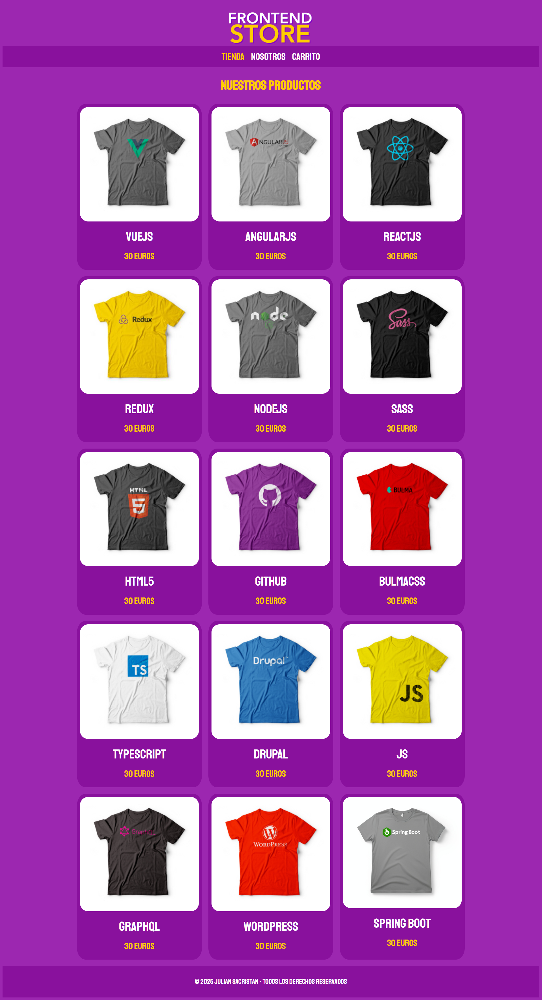
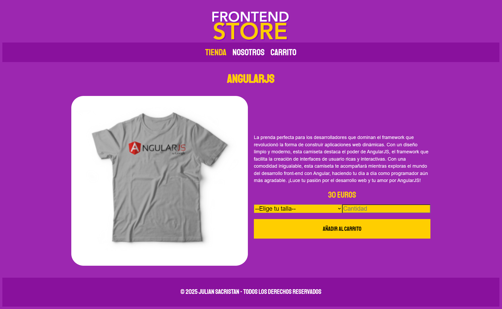
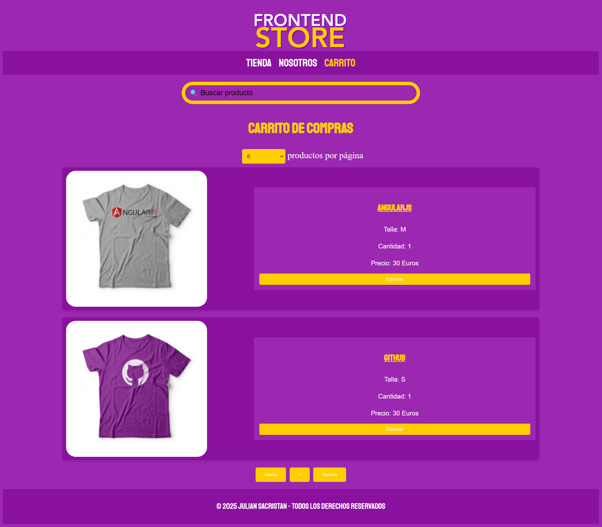

# Front-End Store

Front-End Store is a **Java Spring Boot REST API + MySQL** with a **vanilla JavaScript front-end** that manages a small T-shirt store.  
Users can browse products, view details, and manage a shopping cart with persistence in the browser.

---

## Tech Stack
- **Java 17**  
- **Spring Boot 3**  
  - Spring MVC (REST API)  
  - Spring Data JPA  
  - CORS configuration for frontend consumption  
- **MySQL** (with seed data: 14 T-shirts)  
- **Maven**  
- **HTML5, CSS3, JavaScript (fetch API)**  

---

## Setup & Installation

```bash
# Clone repository
git clone https://github.com/juliandsv/Front-End-Store.git
cd Front-End-Store/store-api
```
---

Configure database:

# src/main/resources/application-example.properties → application.properties
spring.datasource.url=jdbc:mysql://localhost:3306/front_end_store?useSSL=false&serverTimezone=UTC
spring.datasource.username=YOUR_USER
spring.datasource.password=YOUR_PASSWORD

---

## Import database seed:

mysql -u YOUR_USER -p -e "CREATE DATABASE IF NOT EXISTS front_end_store CHARACTER SET utf8mb4;"
mysql -u YOUR_USER -p front_end_store < db/camisetas_seed.sql

---

## Run backend:

mvn spring-boot:run

---

## Open frontend:
Just open the FrontEnd/index.html file in your browser (recommended with Live Server extension in VS Code).

---

## Features

-REST API for product management (14 T-shirts seeded)

-JavaScript front-end with product list, detail, and cart

-Cart stored in browser localStorage

-CORS enabled for API ↔ Frontend communication

-Responsive design

---
## Screenshots

- **Home / Product list**  
  

- **Product detail**  
  

- **Shopping cart**  
  
